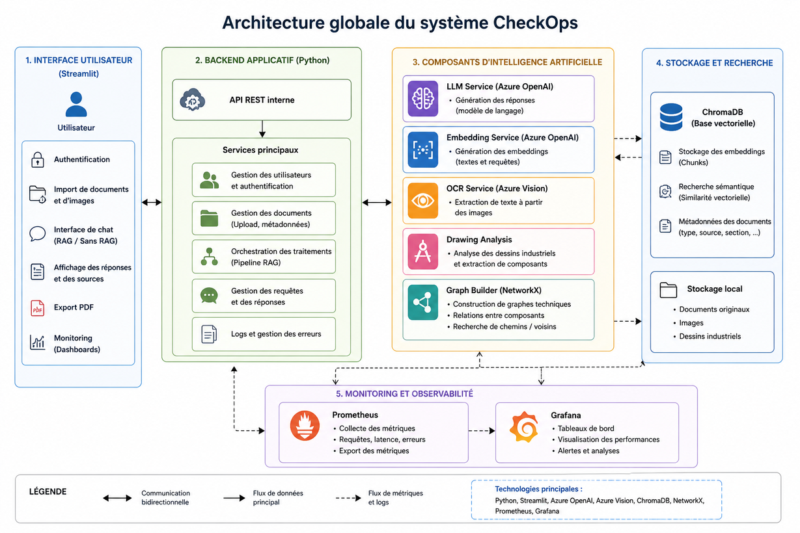
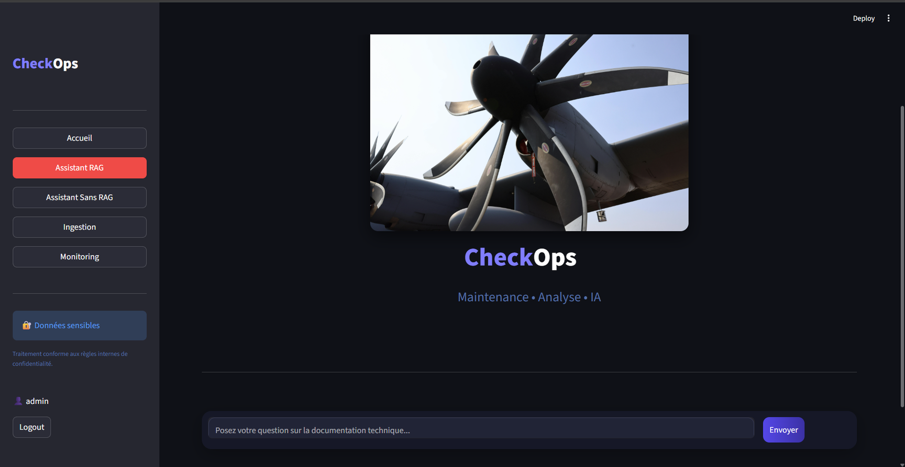
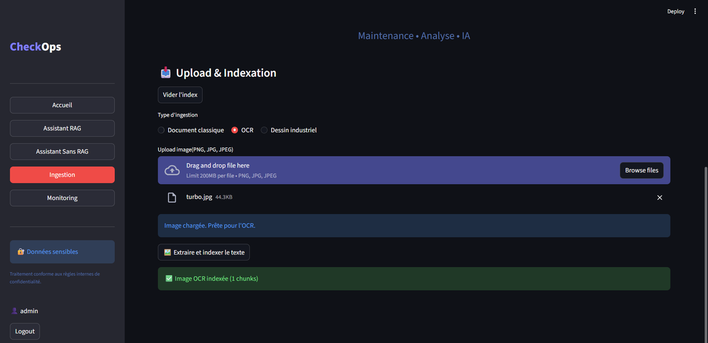
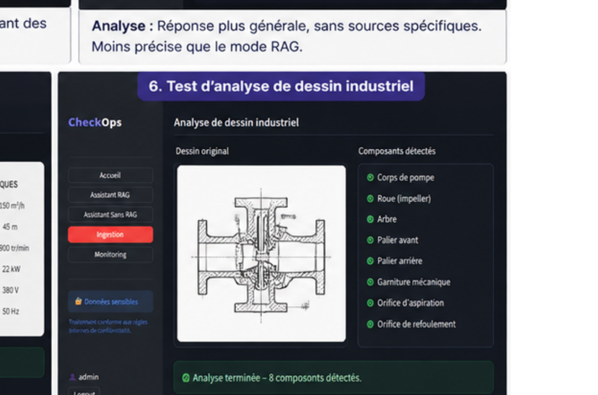
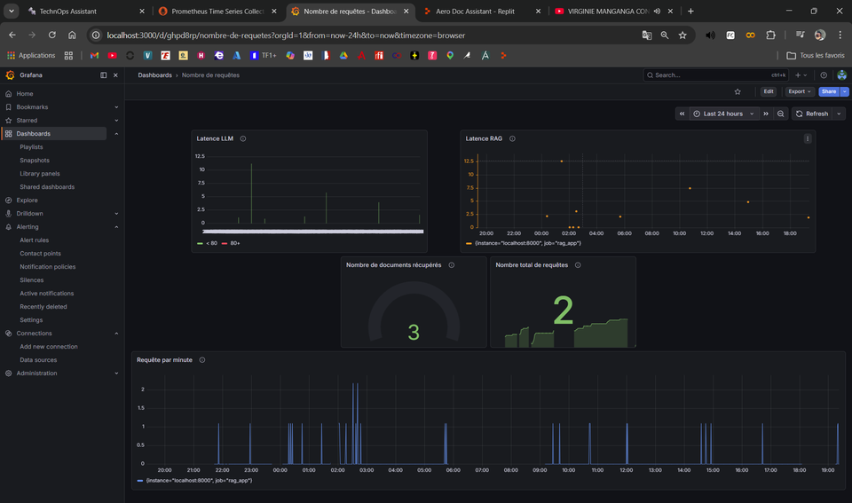

# CheckOps

> Plateforme intelligente basée sur une architecture RAG pour l'exploitation de documentation technique industrielle.

**Python • Azure OpenAI • GPT-4 • ChromaDB • Streamlit • OCR • Computer Vision • NetworkX • Prometheus • Grafana**

---

## Présentation

**CheckOps** est une plateforme intelligente conçue pour faciliter la recherche, l'analyse et l'exploitation de documentation technique dans un contexte industriel.

Le projet repose sur une architecture **Retrieval-Augmented Generation (RAG)** combinant recherche sémantique, modèles de langage, base vectorielle et traitement de documents hétérogènes.

Contrairement à un assistant conversationnel classique, CheckOps recherche d'abord les informations pertinentes dans une base documentaire avant de construire la réponse. Cette approche permet de produire des réponses **contextualisées, traçables et appuyées sur les sources documentaires disponibles**.

La plateforme étend également le RAG traditionnel avec plusieurs capacités complémentaires :

- ingestion de documents techniques ;
- extraction OCR ;
- analyse de dessins industriels ;
- génération de graphes techniques ;
- comparaison RAG / sans RAG ;
- traçabilité des sources ;
- génération de rapports ;
- monitoring de l'application.

---

## Problématique

Dans les environnements industriels et de maintenance, les informations nécessaires à une intervention peuvent être réparties entre de nombreux documents : manuels de maintenance, procédures, rapports, documents scannés, dessins techniques ou autres sources non structurées.

La recherche manuelle de ces informations peut être longue et complexe.

CheckOps répond à la problématique suivante :

> **Comment exploiter des documents techniques hétérogènes à l'aide de l'intelligence artificielle afin de fournir rapidement des réponses pertinentes, contextualisées et traçables ?**

---

## Objectifs

Le projet poursuit plusieurs objectifs :

- centraliser l'exploitation de documents techniques hétérogènes ;
- permettre l'interrogation de la documentation en langage naturel ;
- effectuer une recherche sémantique plutôt qu'une simple recherche par mots-clés ;
- limiter les réponses non fondées grâce à l'utilisation d'un contexte documentaire ;
- conserver la traçabilité des documents utilisés ;
- exploiter les documents scannés grâce à l'OCR ;
- analyser des dessins industriels avec un modèle multimodal ;
- représenter certaines relations techniques sous forme de graphes ;
- superviser le fonctionnement et les performances de la plateforme.

---

## Fonctionnalités principales

### Assistant RAG

L'utilisateur pose une question en langage naturel. La requête est transformée en représentation vectorielle afin d'identifier les informations les plus pertinentes dans la base documentaire.

Les éléments récupérés constituent ensuite le contexte transmis au modèle de langage.

Le système retourne :

- une réponse générée ;
- le contexte documentaire pertinent ;
- les sources associées à la réponse.

### Assistant sans RAG

Un second mode permet d'interroger directement le modèle de langage sans utiliser la base documentaire.

Cette fonctionnalité permet notamment de comparer le comportement d'un LLM classique avec celui d'un système enrichi par récupération documentaire.

### Ingestion documentaire

CheckOps permet d'intégrer différentes sources documentaires dans la base de connaissances.

Le pipeline réalise notamment :

1. la récupération du contenu ;
2. le prétraitement ;
3. le découpage en chunks ;
4. la génération des embeddings ;
5. l'ajout des métadonnées ;
6. l'indexation dans ChromaDB.

### OCR

Le module OCR permet d'extraire du contenu textuel à partir d'images ou de documents scannés.

Le texte obtenu peut ensuite être normalisé, découpé et indexé afin de devenir interrogeable par le moteur RAG.

### Analyse de dessins industriels

CheckOps intègre un module d'analyse visuelle destiné aux dessins industriels.

Un modèle multimodal analyse l'image afin d'identifier et de décrire les informations techniques visibles.

Les résultats peuvent ensuite être intégrés au système documentaire.

### Graphes techniques

Les informations extraites peuvent être structurées sous forme de graphes.

Les composants constituent les **nœuds** du graphe et leurs interactions ou relations techniques constituent les **arêtes**.

Cette représentation complète la recherche textuelle en permettant une lecture relationnelle des informations techniques.

### Consultation des sources

Les documents récupérés lors de la recherche sont conservés avec la réponse.

L'utilisateur peut ainsi identifier les sources ayant contribué à la génération du résultat.

### Génération de rapports

Les résultats d'une interrogation peuvent être exportés sous forme de rapport PDF contenant notamment :

- la question ;
- la réponse générée ;
- les sources utilisées.

### Monitoring

La plateforme expose plusieurs métriques permettant de suivre son fonctionnement.

Le monitoring repose notamment sur :

- **Prometheus** pour la collecte des métriques ;
- **Grafana** pour leur visualisation.

Les métriques suivies peuvent notamment concerner :

- le nombre de requêtes ;
- la latence ;
- les erreurs du pipeline.

---

## Architecture générale

L'application suit une architecture modulaire séparant l'interface utilisateur, les traitements RAG, les services d'intelligence artificielle, la persistance vectorielle et l'observabilité.

<p align="center">
  
</p>

### Flux principal

```text
Utilisateur
    |
    v
Interface Streamlit
    |
    v
Pipeline RAG
    |
    +----> Embedding de la requête
    |
    +----> Recherche sémantique
    |          |
    |          v
    |       ChromaDB
    |          |
    |          v
    +----> Documents pertinents
    |
    +----> Construction du contexte
    |
    +----> Azure OpenAI / LLM
    |
    v
Réponse + Sources
    |
    v
Interface utilisateur
```

Cette séparation facilite la maintenance du code et permet de faire évoluer indépendamment les différents composants.

---

## Pipeline RAG

Le fonctionnement du moteur RAG peut être résumé en deux grandes phases.

### 1. Indexation

```text
Documents
    |
    v
Extraction du contenu
    |
    v
Nettoyage / Normalisation
    |
    v
Découpage en chunks
    |
    v
Génération des embeddings
    |
    v
Indexation dans ChromaDB
```

### 2. Interrogation

```text
Question utilisateur
    |
    v
Embedding de la requête
    |
    v
Recherche vectorielle
    |
    v
Sélection des documents pertinents
    |
    v
Construction du contexte
    |
    v
Génération LLM
    |
    v
Réponse contextualisée + Sources
```

L'intérêt de cette architecture est de dissocier la **récupération de connaissances** de la **génération de texte**.

---

## Recherche multi-sources

La couche de retrieval peut exploiter plusieurs catégories de contenus indexés :

```text
DOC      -> Documents textuels
OCR      -> Contenu extrait par OCR
DRAWING  -> Analyses de dessins industriels
GRAPH    -> Informations issues des graphes techniques
```

Les résultats récupérés sont ensuite sélectionnés afin de constituer le contexte transmis au modèle de génération.

Cette approche permet à CheckOps d'exploiter une base de connaissances plus riche qu'un pipeline RAG uniquement textuel.

---

## Architecture des modules

La logique applicative est organisée autour de plusieurs modules spécialisés.

| Module | Responsabilité |
|---|---|
| `frontend.py` | Interface utilisateur Streamlit |
| `embeddings.py` | Génération des représentations vectorielles |
| `retrieval.py` | Recherche des documents pertinents |
| `generation.py` | Construction et génération des réponses |
| `indexing.py` | Indexation des chunks |
| `vector_store.py` | Gestion de la base vectorielle |
| `ocr.py` | Extraction de texte depuis les images |
| `drawing_analysis.py` | Analyse des dessins industriels |
| `graph_builder.py` | Construction des graphes techniques |
| `logger.py` | Journalisation des événements |
| `monitoring.py` | Exposition des métriques |

---

## Structure du projet

La structure exacte peut évoluer, mais l'organisation générale suit une séparation entre le cœur RAG, les services spécialisés, les données et l'interface.

```text
CheckOps/
│
├── core/
│   ├── embeddings.py
│   ├── generation.py
│   ├── indexing.py
│   ├── retrieval.py
│   └── vector_store.py
│
├── services/
│   ├── ocr.py
│   ├── drawing_analysis.py
│   ├── graph_builder.py
│   └── logger.py
│
├── data/
│
├── chroma_db/
│
├── frontend.py
├── monitoring.py
├── requirements.txt
├── .env.example
└── README.md
```

---

## Stack technique

| Domaine | Technologies |
|---|---|
| Langage | Python |
| Interface | Streamlit |
| LLM | Azure OpenAI |
| Embeddings | Azure OpenAI |
| Base vectorielle | ChromaDB |
| OCR | Pipeline OCR |
| Vision | Modèle multimodal / GPT-4 Vision |
| Graphes | NetworkX |
| Monitoring | Prometheus |
| Visualisation | Grafana |
| Reporting | ReportLab |
| Configuration | Variables d'environnement |

---

## Installation

### Prérequis

Avant de lancer le projet, vérifier la présence de :

- Python 3.x ;
- pip ;
- un environnement Azure OpenAI configuré ;
- les accès nécessaires aux modèles utilisés ;
- Prometheus et Grafana si le monitoring est activé.

### 1. Cloner le dépôt

```bash
git clone <URL_DU_DEPOT>
cd CheckOps
```

### 2. Créer un environnement virtuel

Sous Windows :

```bash
python -m venv venv
venv\Scripts\activate
```

Sous Linux / macOS :

```bash
python3 -m venv venv
source venv/bin/activate
```

### 3. Installer les dépendances

```bash
pip install -r requirements.txt
```

---

## Configuration

Les informations sensibles ne doivent pas être stockées directement dans le dépôt GitHub.

Créer un fichier `.env` à partir du modèle fourni :

```bash
cp .env.example .env
```

Exemple de configuration :

```env
AZURE_OPENAI_ENDPOINT=<your-endpoint>
AZURE_OPENAI_API_KEY=<your-api-key>
AZURE_OPENAI_API_VERSION=<api-version>

AZURE_OPENAI_CHAT_DEPLOYMENT=<chat-deployment>
AZURE_OPENAI_EMBEDDING_DEPLOYMENT=<embedding-deployment>
```

Les noms exacts des variables doivent être adaptés à la configuration utilisée dans le projet.

> Ne jamais publier de clé API, mot de passe ou secret dans le dépôt.

---

## Lancement de l'application

Une fois l'environnement configuré :

```bash
streamlit run frontend.py
```

L'interface Streamlit est alors accessible depuis l'adresse locale indiquée dans le terminal.

---

## Utilisation

### Ajouter des connaissances

1. Ouvrir l'espace d'ingestion.
2. Sélectionner un document.
3. Lancer le traitement.
4. Vérifier l'indexation.
5. Interroger ensuite le contenu depuis l'assistant.

### Interroger le RAG

Exemple :

```text
Quels sont les composants principaux d'une pompe centrifuge ?
```

Le pipeline :

1. vectorise la question ;
2. recherche les passages pertinents ;
3. sélectionne le contexte ;
4. transmet le contexte au LLM ;
5. génère la réponse ;
6. retourne les sources associées.

---

## Interface

### Assistant

<p align="center">
  
</p>

### Ingestion documentaire

<p align="center">
  
</p>

### Analyse de dessins industriels

<p align="center">
  
</p>

### Monitoring

<p align="center">
  
</p>

> Les chemins d'images ci-dessus peuvent être adaptés à l'organisation du dépôt.

---

## Observabilité

L'observabilité fait partie intégrante de l'architecture.

Des métriques applicatives peuvent être exposées à Prometheus puis visualisées dans Grafana.

Exemples :

```text
rag_requests_total
rag_latency_seconds
rag_errors_total
```

Cette couche permet notamment :

- de suivre l'activité du système ;
- d'analyser les temps de traitement ;
- de détecter les erreurs ;
- d'identifier des axes d'optimisation.

---

## Sécurité

Plusieurs principes sont pris en compte dans le projet :

- séparation des secrets et du code source ;
- utilisation de variables d'environnement ;
- authentification des utilisateurs ;
- limitation de l'accès aux fonctionnalités selon le rôle ;
- journalisation des opérations importantes.

### Important

L'authentification actuelle constitue une implémentation adaptée au prototype.

Pour une mise en production, elle devrait être remplacée ou renforcée par un système d'identité dédié, avec notamment :

- stockage sécurisé des utilisateurs ;
- algorithme de hachage adapté aux mots de passe ;
- gestion des sessions ;
- contrôle d'accès renforcé ;
- rotation et gestion centralisée des secrets.

---

## Validation

Plusieurs scénarios permettent de valider les principales briques du système :

| Test | Objectif |
|---|---|
| Assistant RAG | Vérifier la génération à partir des documents |
| Sans RAG | Disposer d'un point de comparaison |
| Ingestion | Vérifier le traitement et l'indexation |
| OCR | Vérifier l'exploitation d'un document image |
| Dessin industriel | Vérifier l'analyse multimodale |
| Sources | Vérifier la traçabilité documentaire |
| Monitoring | Vérifier la remontée des métriques |

Les tests portent à la fois sur le fonctionnement des modules et sur leur intégration dans le pipeline global.

---

## Limites actuelles

Le prototype présente plusieurs limites qui constituent également des axes de recherche et d'amélioration :

- dépendance à la qualité des documents sources ;
- erreurs possibles lors de l'extraction OCR ;
- analyse visuelle dépendante de la qualité des dessins ;
- latence liée aux appels aux modèles externes ;
- performances du retrieval dépendantes de la stratégie de chunking et d'indexation ;
- risque résiduel d'hallucination du modèle ;
- authentification à renforcer pour un environnement de production ;
- validation métier nécessaire avant toute utilisation sur des opérations industrielles critiques.

CheckOps doit être considéré comme un **outil d'assistance à la recherche et à l'analyse**, et non comme un substitut aux documents techniques approuvés ou à la validation d'un expert.

---

## Perspectives

Plusieurs évolutions sont envisagées.

### Retrieval

- recherche hybride sémantique + lexicale ;
- reranking des documents récupérés ;
- stratégies de chunking adaptées au type documentaire ;
- filtres avancés sur les métadonnées ;
- évaluation automatisée de la qualité du retrieval.

### Intelligence artificielle

- évaluation systématique des réponses RAG ;
- amélioration du grounding ;
- modèles multimodaux plus avancés ;
- extraction structurée des informations techniques ;
- stratégies agentiques pour les traitements complexes.

### Industrialisation

- conteneurisation avec Docker ;
- pipeline CI/CD ;
- tests unitaires et d'intégration automatisés ;
- gestion centralisée des secrets ;
- authentification d'entreprise ;
- déploiement cloud ;
- observabilité distribuée ;
- gestion des versions des modèles et des prompts.

### Data & MLOps

- versionnement des jeux documentaires ;
- suivi des expériences ;
- métriques de qualité du retrieval ;
- évaluation continue du RAG ;
- détection de dérive documentaire ;
- suivi du coût et de la latence des appels LLM.

---

## Principes d'architecture

CheckOps a été développé autour de plusieurs principes :

**Modularité**  
Chaque responsabilité principale est isolée dans un module spécialisé.

**Traçabilité**  
Les réponses RAG conservent un lien avec les informations récupérées.

**Extensibilité**  
De nouvelles sources ou stratégies de retrieval peuvent être intégrées sans reconstruire l'ensemble de l'application.

**Observabilité**  
Les métriques permettent d'analyser le comportement du système.

**Approche multimodale**  
Le système ne se limite pas au texte et peut exploiter des contenus issus de l'OCR et de l'analyse visuelle.

---

## Cas d'usage envisagés

Bien que développé autour de problématiques de maintenance industrielle, le socle technique peut être adapté à d'autres contextes nécessitant l'exploitation de documentation complexe :

- maintenance aéronautique ;
- maintenance industrielle ;
- documentation d'ingénierie ;
- procédures qualité ;
- assistance technique ;
- capitalisation des connaissances ;
- recherche dans des référentiels documentaires.

---

## Statut du projet

**Prototype fonctionnel / Projet pédagogique**

Le projet démontre la conception et l'intégration d'une chaîne RAG multimodale complète, depuis l'ingestion documentaire jusqu'à la génération de réponses, la traçabilité des sources et le monitoring.

Il n'est pas destiné, dans son état actuel, à être utilisé comme système décisionnel autonome dans un environnement industriel critique.

---

## Auteur

**Ghood MOUANDZA PATY**

Projet réalisé dans le cadre d'un cursus **MBA Big Data & Intelligence Artificielle**.

Domaines d'intérêt :

- Data Science
- Machine Learning
- Generative AI
- Retrieval-Augmented Generation
- Data Engineering
- MLOps
- Intelligence artificielle appliquée à l'industrie et à la maintenance

---

## Licence

Ce projet a été développé à des fins pédagogiques et de démonstration.

Les conditions de réutilisation du code doivent être définies dans le fichier `LICENSE` du dépôt.

---

## Avertissement

Les réponses produites par CheckOps dépendent des documents disponibles, des paramètres de récupération et des modèles utilisés.

Dans un environnement industriel réel, toute information susceptible d'influencer une opération de maintenance, de sécurité ou de conformité doit être vérifiée à partir de la **documentation technique officielle applicable et à jour**.
